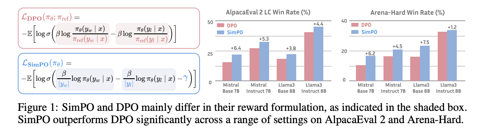
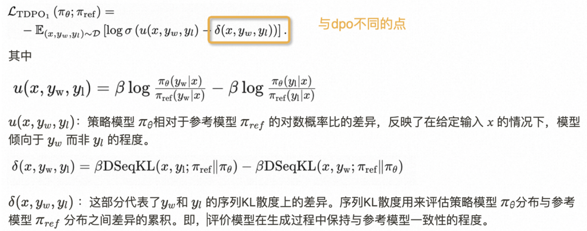
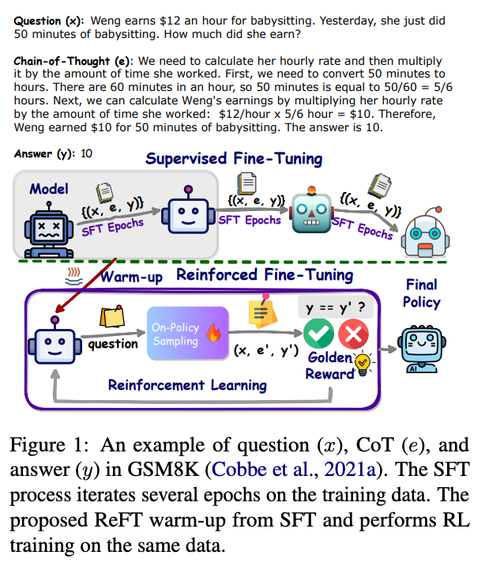

不定期持续更新中，上次更新日期：2025.02.23 ↓↓↓

## ↓ 2025
    大规模RL + 思维链带来的收益
#### 22 Jan 2025, DeepSeek, DeepSeek-R1: Incentivizing Reasoning Capability in LLMs via Reinforcement Learning -> [Link](https://arxiv.org/abs/2501.12948)
#### 22 Jan 2025, DeepSeek, Kimi k1.5: Scaling Reinforcement Learning with LLMs -> [Link](https://arxiv.org/abs/2501.12599)

## ↓ 2024
    💡 PPO变体出现，一个方向是去掉critic model，代表作GRPO、RLOO等，另一方向是rule base的RFT，代表作openai的Rule Based Rewards for Language Model Safety、字节的REFT等
#### 
#### 27 Dec 2024, DeepSeek, DeepSeek-V3 Technical Report -> [Link](https://arxiv.org/abs/2412.19437)
#### 20 Dec 2024, openai, Deliberative Alignment: Reasoning Enables Safer Language Models -> [Link](https://arxiv.org/pdf/2412.10560)
> * openai在安全领域的探索，通过思维链对安全准则进行回忆，从而指导模型的回答
> 
> * 具体做法：
>   * sft：
>       * 数据生成：prompt + 安全分类cat --安全准则spec + base model--> cot + output
>       * 数据过滤：prompt + 安全分类cat + cot + output --安全准则spec + generative reward model--> score
>       * 训练：prompt + cot + output
>   * RL：
>       * 采样：prompt + 安全分类cat --sft model--> cot + output
>       *  RM：prompt + 安全分类cat + output 安全准则spec + generative reward model--> score
>       * 优化policy
>   * 使用思维链对模型回答进行评估，从而指导模型的回答
#### 8 Dec 2024, Zhipu AI, Does RLHF Scale? Exploring the Impacts from Data, Model, and Method -> [Link](https://arxiv.org/pdf/2412.06000)
> * 智谱的强化组的工作，探索RL Scale Law
> * 从采样次数、reward model大小、ppo vs grpo vs BON、到PRM vs ORM等
#### 17 Jun 2024, NVIDIA, Nemotron-4 340B Technical Report -> [Link](https://arxiv.org/pdf/2406.11704)
> * 数据：
>   * 生成单轮prompt：生成宏观主题 -> 子主题 -> 生成问题 -> 问题细化
>   * 对话生成
>   * 合成偏好数据生成：奖励模型准确率 > 大型语言模型作为评判的准确率
> * 训法：
>   * 分段的监督式微调：代码SFT -> 通用监督式微调（General SFT）+ 2%的代码
>   * 偏好微调:
>     * DPO损失+SFT损失 （160K个样例的偏好数据集，覆盖了多样的任务类型）
>     * 3轮 奖励驱动的偏好优化RPO（30万个样本的偏好数据集）
>     * Reward Model：
>       * 细粒度多头的Regression Model：Helpfulness, Correctness, Coherence, Complexity, Verbosity
>       * 用的时候多维度加权平均
#### 24 July 2024, OpenAI,Rule Based Rewards for Language Model Safety -> [Link](https://cdn.openai.com/rule-based-rewards-for-language-model-safety.pdf)
> * OpenAI 在大模型学习安全性强化上，又回归了经典的基于规则的奖励(RBR)机制。（之前尝试了PRM的方式作数学）
#### 2 Jun 2024, University of Chicago, RLOO: BoNBoN Alignment for Large Language Models and the Sweetness of Best-of-n Sampling -> [Link](https://arxiv.org/pdf/2406.00832v1) 
> * 多个消融实验，证明可以将ppo退化为reinforce算法，即去掉critic model
#### 23 May 2024, University of Virginia, SimPO: Simple Preference Optimization with a Reference-Free Reward -> [Link](https://arxiv.org/pdf/2405.14734)
>   * 从实验来看，比较扎实，对比了很多算法，优于DPO，KTO，IPO，ORPO，RDPO
>   * 不会增加回复长度，一些工作认为长度是一种偏好的hack
>   * SimPO使用改用样本长度做缩放来代替参考模型，后面再加了一个类似于margin的项（定值）
>   * ps：看到有不少兄弟用起来还是容易飞--Link
>   * 图：simpo vs dpo
> 
#### 14 May 2024, DeepMind, Understanding the performance gap between online and offline alignment algorithms -> [Link](https://arxiv.org/pdf/2405.08448)
>   * 从以下几个方面解释和证明了在线强化学习更好
>     * 数据质量：离线算法的数据可能来自次优策略，导致其训练效果较差。如果离线数据来自高质量的策略，离线算法的性能会更好。
>     * 模型规模的影响：模型规模的变大可以缩小离线和在线的差距
>     * 过优化现象：在线和离线算法在都出现过优化现象，但是在相同时间节点，在线算法更优
>     * ...等
#### 13 May 2024, UIUC, RLHF Workflow: From Reward Modeling to Online RLHF -> [Link](https://arxiv.org/pdf/2405.07863)
> * 基于 DPO 的在线迭代 RLHF
>   * 主要流程：1) 首先使用开源偏好数据集上运行 DPO； 2）最大化差异采样（探索）response，用reward model打分，使用DPO进行迭代。
> * 「前置工作」18 Dec 2023, UIUC, Iterative Preference Learning from Human Feedback: Bridging Theory and Practice for RLHF under KL-Constraint (ICML2024) -> [Link](https://arxiv.org/pdf/2312.10560)
#### 7 May 2024, DeepSeek-AI, DeepSeek-V2: A Strong, Economical, and Efficient Mixture-of-Experts Language Model -> [Link](https://arxiv.org/abs/2405.04434)
> * 「前置工作」使用Group Relative Policy Optimization (GRPO) 的算法来进行对齐训练，算法出自DeepSeekMath
>   * 避免使用评价模型：传统的强化学习方法通常需要一个与策略模型同等大小的评价模型来提供训练信号。GRPO算法不使用评价模型，而是从一组输出的得分中估计基线。
>   * 组相对优化：对于每个输入，GRPO会从旧策略中采样一组输出，然后优化策略模型以最大化特定的目标函数。这个过程利用组内输出的相对得分来调整策略，提高其选择合适回应的概率。
>   * DeepSeek-V2的强化学习训练分为两个阶段：第一阶段是基于逻辑和数学推理任务的对齐，第二阶段是基于人类偏好的对齐。
#### 1 May 2024, University of Illinois Urbana-Champaign, Iterative Preference Learning from Human Feedback- BridgingTheory and Practice for RLHF under KL-constraint -> [Link](https://arxiv.org/pdf/2312.11456)
> * 文章主要包括两个部分:
>   * 整个 RLHF 的理论，
>   * 在 RLHF 中加入 online data 的好处
> * [围观] 作者之一：[Wei Xiong：为什么我们应该做online RLHF/DPO?](https://zhuanlan.zhihu.com/p/688806682)
#### 1 May 2024, University of California(CMU), SPPO: Self-Play Preference Optimization for Language Model Alignment -> [Link](https://arxiv.org/abs/2405.00675)
> * SPPO通过自对弈的方式进行模型微调，每一轮中，模型在由模型本身生成的合成数据上进行微调，并由偏好模型来判断合成数据的胜负率。可以看成是在模拟两个玩家之间的对弈，其中每个玩家都试图优化自己的模型以最大化其胜率。
#### April 29, 2024, bigcode, StarCoder2-Instruct: Fully Transparent and Permissive Self-Alignment for Code Generation -> [Link](https://mp.weixin.qq.com/s/g2VvvKCy577XdYQKEmAXzw)
> * 代码生成任务的自我对齐
#### 23 Apr 2024, Arizona State University, Insights into Alignment: Evaluating DPO and its Variants Across Multiple Tasks -> [Link](https://arxiv.org/pdf/2404.14723v1?_immersive_translate_auto_translate=1)
> * 实验对DPO、IPO、KTO、CPO四种算法上在13 个测试集上进行对比实验，基线是Mistral+SFT，结果为base+KTO效果最好（不需要SFT）
#### 29 Apr 2024, Peking University, DPO Meets PPO: Reinforced Token Optimization for RLHF -> [Link](https://arxiv.org/pdf/2404.18922)
> * 对比了几种level的强化算法，并提出RTO，中文参考 -> [Link](https://zhuanlan.zhihu.com/p/698536446)
> * token-level reward，常见的场景是detoxification
> * 建模为step(sub-sentence)-level reward的PRM
> * 从sentence level的reference data中间接学到的token-level reward，RTO属于此类方法
#### 18 Apr 2024, University of Chinese Academy of Sciences&Microsoft Research AI4Science, Token-level Direct Preference Optimizationc -> [Link](https://arxiv.org/html/2404.11999v1?_immersive_translate_auto_translate=1)
> * TDPO的一个关键特点是：直接在token级别上应用偏好优化，可以更精细地控制模型输出
> * 
#### 16 Apr 2024, Tsinghua University, Is DPO Superior to PPO for LLM Alignment? A Comprehensive Study -> [Link](https://arxiv.org/html/2404.10719v2?_immersive_translate_auto_translate=1)
> * DPO的根本性问题：在DPO公式的中，当x=0，log(σ(x)) = 0.693，即当模型不够自信的时候，会对一些偏好模糊的样本进行正向更新，可能会发展出一些奇怪的行为，这些行为在训练数据中看不到，但却受到了DPO的青睐。
> * PPO通常通过一系列技术如策略梯度、优势函数以及策略的进步裁剪（clipping），来避免过大的策略更新，从而在面对不确定性时提供更平滑、更稳定的学习路径
#### Apr 2024, fuyao, Llama 3 Opens the Second Chapter of the Game of Scale -> [Link](https://yaofu.notion.site/Apr-2024-Llama-3-Opens-the-Second-Chapter-of-the-Game-of-Scale-efff1c0c185f4008af673b78faf83b61)
> * fuyao大佬对llama3的分析，在数据量见顶以后，强化将会发挥主要作用
#### 18 Apr 2024, Stanford, From r to Q∗: Your Language Model is Secretly a Q-Function -> [Link](https://arxiv.org/pdf/2404.12358.pdf)
> * DPO 作者，结合强化的原理对DPO进行分析和解释
> * 中文硬核分析：[陈陈：DPO新作Your Language Model is Secretly a Q-Function解读，与OPENAI Q* 的联系？](https://zhuanlan.zhihu.com/p/693746297)
#### 15 Apr 2024, microsoft, WizardLM-2 (蹲一下这篇论文)
> * 「前置工作」18 Aug 2023, microsoft, WizardMath: Empowering Mathematical Reasoning for Large Language Models via Reinforced Evol-Instruct (WizardLM-2中的RLEIF)
> * 「前置工作」31 May 2023, openai, Let's Verify Step by Step (WizardLM-2中的PRM)
> * 「前置工作」28 Mar 2024, sDPO: Don't Use Your Data All at Once (stage dpo的一种)
> * WizardLM-2对齐训练过程值得参考
> * 模型下载和模型简单介绍：[Replete-AI/WizardLM-2-7b · Hugging Face](https://huggingface.co/posts/WizardLM/329547800484476)
> 
#### 3 Apr 2024, ZhiPu, ChatGLM-Math: Improving Math Problem-Solving in Large Language Models with a Self-Critique Pipeline -> [Link](https://mp.weixin.qq.com/s/lg7ueR9b-om0ecUEoT4x8w)
> * 用Math-Critique model给多个答案打分，进行Rejective Fine-tuning，再到DPO
> * dpo变种，通过加入额外的loss作为正则项，
#### 1 Apr 2024, Zhipu AI&Tsinghua University, ChatGLM-RLHF: Practices of Aligning Large Language Models with Human Feedback -> [Link](https://arxiv.org/pdf/2404.00934)
> * 数据工作：怎么保证偏好的一致性
> * 分析了相对RLHF在某些维度为什么不如SFT：奖励模型的准确性，RLHF的训练数据与SFT训练数据的分布的差异
#### 26 Mar 2024, University of Edinburgh&University of Illinois Urbana-Champaign, Alignment Guidebook -> [Link](https://efficient-unicorn-451.notion.site/Alignment-Guidebook-e5c64df77c0a4b528b7951e87337fa78)
> * 提出了 ConditionalOnLine RLHF RLHF，使用一种新颖的条件奖励模型，可以调和不同类型的人类偏好（例如，多步骤推理准确性、有用性、无害性），并进行三轮在线 RLHF。
> * 同时，提到了一些训练细节，比如在PPO阶段为什么需要在把actor freeze 50步? -> Link
#### 5 Mar 2024, PERL: Parameter Efficient Reinforcement Learning from Human Feedback -> [Link](https://arxiv.org/pdf/2403.10704.pdf)
> * 使用RLHF的偏好数据，进行参数高效的对齐
#### 12 Mar 2024, ORPO: Monolithic Preference Optimization without Reference Model -> [Link](https://arxiv.org/abs/2403.07691)
> * SFT 的损失函数对于rejected data没有惩罚项，SFT 之后正样本和负样本的生成概率有可能同时上升
#### 4 Mar 2024, Anthropic, The Claude 3 Model Family: Opus, Sonnet, Haiku -> [Link](https://assets.anthropic.com/m/61e7d27f8c8f5919/original/Claude-3-Model-Card.pdf)
> * 参考模型：https://www-cdn.anthropic.com/de8ba9b01c9ab7cbabf5c33b80b7bbc618857627/Model_Card_Claude_3.pdf
> * reference跟强化相关的论文：
>   * [10] Anthropic, “Challenges in evaluating AI systems.” October, 2023. https://www.anthropic.com/index/evaluating-ai-systems.
>   * [11] Anthropic, “Red Teaming Language Models to Reduce Harms: Methods, Scaling Behaviors, and Lessons Learned.” August, 2022. https://www.anthropic.com/index/ red-teaming-language-models-to-reduce-harms-methods-scaling-behaviors-and-lessons-learned.
>   * [12] Anthropic, “The Capacity for Moral Self-Correction in Large Language Models.” February, 2023. https://www.anthropic.com/index/the-capacity-for-moral-self-correction-in-large-language-models.
>   * [14] Anthropic, “Frontier Threats Red Teaming for AI Safety.” July, 2023. https://www.anthropic.com/index/frontier-threats-red-teaming-for-ai-safety.
#### 2 Mar 2024, ByteDance, Improving Reinforcement Learning from Human Feedback Using Contrastive Rewards -> [Link](https://arxiv.org/abs/2403.07708)
> * 使用对比Reward改进RLHF
#### 29 Feb 2024, DeepMind, ArCHer: Training Language Model Agents via Hierarchical Multi-Turn RL -> [Link](https://arxiv.org/html/2402.19446v1?_immersive_translate_auto_translate=1)
> * 解决LLMs在多个回合中智能地搜索和整合信息的能力
#### 5 Feb 2024, DeepSeek-AI, DeepSeekMath: Pushing the Limits of Mathematical Reasoning in Open Language Models -> [Link](https://arxiv.org/html/2402.03300v3?_immersive_translate_auto_translate=1)
> * 首次提出群相对策略优化 （GRPO），这是近端策略优化 （PPO） 的变体，增强数学推理能力，同时优化 PPO 的内存使用。
#### 18 Jan 2024, Meta, Self-Rewarding Language Models -> [Link](https://arxiv.org/abs/2401.10020)
> * 实现简单，可以看成rj的加强版。结合wizard的指令进化、LLama的reject sampling、DPO进行循环迭代对齐
> * 类似方法：2 May 2024 D2PO: Discriminator-Guided DPO with Response Evaluation Models
#### 17 Jan 2024, ByteDance, ReFT: Reasoning with Reinforced Fine-Tuning -> [Link](https://arxiv.org/abs/2401.08967)
> * rule base的RFT，跟openai的RFT微调类似
> * 解决的问题：CoT训练样本通常只包含一条正确的推理路径，但是在数学领域下，一个正确答案往往有多个解法（即不同的推理路径）
> * 方法：
>   * 先用cot数据微调1-2个epoch
>   * 再用rule reward mode进行强化学习，通过模型采用获得多种推理路径，从而达到泛化的效果
> 
#### 11 Jan 2024, Fudan NLP Lab & Fudan Vision and Learning Lab, Secrets of RLHF in Large Language Models Part II: Reward Modeling -> [Link](https://arxiv.org/abs/2401.06080)
> * 复旦自然语言实验室，邱锡鹏老师组的工作
> * 「前置工作」11 Jul 2023, Fudan NLP Lab & Fudan Vision and Learning Lab, Secrets of RLHF in Large Language Models Part I: PPO
#### 16 Jan 2024, ICLR2024, CPPO: Continual Learning for Reinforcement Learning with Human Feedback -> [Link](https://openreview.net/pdf?id=86zAUE80pP)
#### 8 Jan 2024, Google&CMU, A Minimaximalist Approach to Reinforcement Learning from Human Feedback (SPO) -> [Link](https://arxiv.org/pdf/2401.04056.pdf)
#### 2 Jan 2024,  University of California, SPIN: Self-Play Fine-Tuning Converts Weak Language Models to Strong Language Models -> [Link](https://arxiv.org/pdf/2401.01335)

##  ↓ 2023
    💡 以各种DPO的变体为主题

#### 14 Dec 2023, OpenAI, Weak-to-strong generalization -> [Link](https://openai.com/research?topics=safety-alignment)
> * [OpenAI的Weak-to-Strong在说什么](https://zhuanlan.zhihu.com/p/673427353)
#### 1 Dec 2023, Tsinghua University, RLHF-V: Towards Trustworthy MLLMs via Behavior Alignment from Fine-grained Correctional Human Feedback -> [Link](https://arxiv.org/abs/2312.00849)
> * 解决多模态模型的幻觉问题
#### 14 Nov 2023, Tencent , Adversarial Preference Optimization -> [Link](https://arxiv.org/abs/2311.08045)
#### 28 Mar 2022, ICLR2022, The N Implementation Details of RLHF with PPO -> [Link](https://huggingface.co/blog/the_n_implementation_details_of_rlhf_with_ppo)
* https://openreview.net/forum?id=Hl6jCqIp2j
#### 16 Oct 2023 , The Chinese University of Hong Kong, ReMax: A Simple, Effective, and Efficient Reinforcement Learning Method for Aligning Large Language Models -> [Link](https://arxiv.org/pdf/2310.10505.pdf)
> * 去掉了A2C里的critic model，只使用reward更新模型，但是会非常不稳定，所以通过减掉一个baseline来降低reward的方差
#### 6 Oct 2023, UCL&DeepMind&CMU, Confronting Reward Model Overoptimization with Constrained RLHF-> [Link](https://arxiv.org/abs/2310.04373)
> * ICLR 2024 Spotlight，主要解决由于奖励模型只是人类评估的不完美代理，因此存在过优化的风险 
> * 属于进一步解决openai的Scaling Laws for Reward Model Overoptimization中的问题
#### 4 Oct 2023, University of Cambridge, Reward Model Ensembles Help Mitigate Overoptimization -> [Link](https://arxiv.org/abs/2310.02743)
> * ICLR 2024 Spotlight，同样解决rlhf的过度优化问题
#### 28 Sep 2023, Johns Hopkins University(霍普金斯大学)&Tencent AI Lab, The Trickle-down Impact of Reward (In-)consistency on RLHF -> [Link](https://arxiv.org/pdf/2309.16155.pdf)
> * ICLR 2024, 解决偏好数据一致性问题
#### 4 Oct 2023, University of Cambridge, Reward Model Ensembles Help Mitigate Overoptimization -> [Link](https://arxiv.org/abs/2310.02743)
> *ICLR 2024, 同样解决rlhf的过度优化问题
#### 25 Sep 2023, UC Berkeley&CMU, LLAva-RLHF: Aligning Large Multimodal Models with Factually Augmented RLHF -> [Link](https://llava-rlhf.github.io/)
> * 多模态的RLHF
#### 25 Sep 2023, CMU, Aligning Large Multimodal Models with Factually Augmented RLHF -> [Link](https://arxiv.org/abs/2309.14525)
#### 27 Jul 2023, OpenAI, Superalignment with Jan Leike
> * https://mp.weixin.qq.com/s/P45Mi_dxFxRGjk57XhFJSQ
> * https://podcasts.google.com/feed/aHR0cHM6Ly9heHJwb2RjYXN0LmxpYnN5bi5jb20vcnNz/episode/MThlYjczZGItZmYxZS00MDU0LWJmOGYtZGRhNWM0ODkzNGM0
#### 19 Jul 2023, Meta, Llama 2: Open Foundation and Fine-Tuned Chat Models -> [Link](https://arxiv.org/abs/2307.09288)
> * 结合了Anthropic论文中的思想使用了两种RM
#### 29 May 2023, Stanford, Direct Preference Optimization(DPO): Your Language Model is Secretly a Reward Model
> * DPO的各种改进版：
>   * 「改进训练流程」28 Mar 2024, sDPO: Don't Use Your Data All at Once -> [Link](https://arxiv.org/abs/2403.19270)
>   * 「改进loss」2 Feb 2024, Stanford, KTO: Model Alignment as Prospect Theoretic Optimization -> [Link](https://arxiv.org/abs/2402.01306)
>   * 「改进loss」18 Oct 2023, Deepmind, A General Theoretical Paradigm to Understand Learning from Human Preferences (IPO)
>   * 「改进loss」 25 November 2023, A note on DPO with noisy preferences & relationship to IPO -> [Link](https://ericmitchell.ai/cdpo.pdf) 
>       * 通过加入label_smoothing改进dpo对偏好噪声的影响
>   * 「改进流程」15 Apr 2024, (Trust Region)TR-DPO: Learn Your Reference Model for Real Good Alignment 
>       * 通过更新ref model 可以带来更好的效果，注意：需要设置合适的ref model更新超参

## ↓ 2022
    💡 openai、Anthropic早期对ppo的探索

#### 19 Oct 2022, OpenAI, Scaling Laws for Reward Model Overoptimization (RLHF的scaling law：PPO阶段应该何时停止训练)
> * https://arxiv.org/abs/2210.10760
#### 12 Apr 2022, Anthropic, Training a Helpful and Harmless Assistant with Reinforcement Learning from Human Feedback
> * 中文版：https://zhuanlan.zhihu.com/p/605133974
> * 有帮助与无害的训练数据比例
#### 25 Mar 2022, ICLR Blog Track, The 37 Implementation Details of Proximal Policy Optimization （RL训练的37个Trick）
> * https://iclr-blog-track.github.io/2022/03/25/ppo-implementation-details/
#### 4 Mar 2022, OpenAI, Training language models to follow instructions with human feedback（OpenAI在LLM强化做法）
> * https://arxiv.org/abs/2203.02155

## ↓ 2016
    💡 ppo的基础

#### 2016, ICLR, High-dimensional continuous control using generalized advantage estimation. (GAE，几乎所有最先进的policy gradient算法实现里面都使用了该技术。)
> * https://arxiv.org/pdf/1506.02438.pdf
> * https://zhuanlan.zhihu.com/p/45107835?from=groupmessage&utm_id=0
> * https://zhuanlan.zhihu.com/p/402198744

